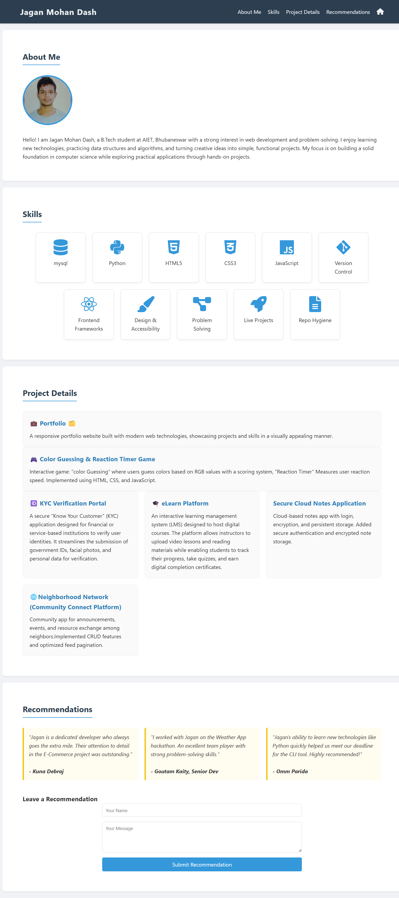

# Jagan Mohan Dash — Portfolio

**Live site:** https://username.github.io/portfolio

---

## 👨‍💻 About Me
Hello! I am **Jagan Mohan Dash**, a passionate Full Stack Developer based in AIET, Bhubaneswar.  
I specialize in building web applications and solving complex problems with clean, efficient code.

---

## 🛠️ Skills
- HTML5  
- CSS3  
- JavaScript  
- MySQL  
- SQLite
- Python  

---

## 🚀 Major Engineering & Full‑Stack Projects

### KYC Verification Portal (Identity Management System)
Role: Backend Developer  
Tech: Python; Flask/Django; MySQL  
Summary: Secure portal for uploading and verifying identity documents with admin approval workflows.  
Key Achievement: Implemented validation pipeline reducing manual checks.

### eLearn Platform (Learning Management System)
Role: Full Stack Developer  
Tech: HTML; CSS; JavaScript; Node.js; MySQL  
Summary: Online platform for course management, assignments, and student progress tracking.  
Key Achievement: Built role‑based dashboards for students and instructors.

### Secure Cloud Notes Application (Data Persistence Project)
Role: Full Stack Developer  
Tech: Node.js; Express; MongoDB; JWT  
Summary: Cloud‑based notes app with login, encryption, and persistent storage.  
Key Achievement: Added secure authentication and encrypted note storage.

---

## 🛠️ Technical & Logic‑Based Projects

### Neighborhood Network (Community Connect Platform)
Role: Full Stack Developer  
Tech: HTML; CSS; JavaScript; Node.js; MySQL; Socket.io  
Summary: Community app for announcements, events, and resource exchange among neighbors.  
Key Achievement: Implemented CRUD features and optimized feed pagination.

---

## 🎮 Web Games & Interactive Tools

### Color Guessing Game & Reaction Timer
Role: Developer  
Tech: HTML; CSS; JavaScript  
Summary: Interactive game where users guess colors based on RGB values & Measures user reaction speed with timed prompts.   
Key Achievement: Enhanced logic for difficulty levels & Built accurate timing logic with millisecond precision.

---

## 📸 Screenshots
Add screenshots of your flagship projects here.  
Example:
```markdown


💬 Recommendations
“Jagan consistently delivers clean, maintainable code and helps teammates learn new tools.” — Kuna Debraj, College Peer

“Jagan approaches problems methodically and supports classmates during group projects.” — Goutam Kaity, College Peer

“Always reliable and eager to learn; Jagan contributes thoughtful ideas in every team discussion.” — Ommi Parida, College Pee